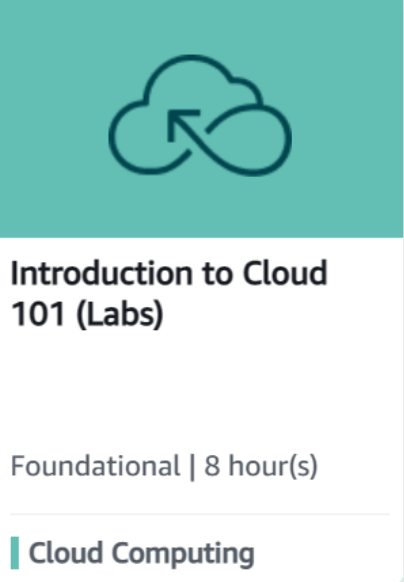

# 高级Web技术Lab 1： Docker部署

## 任务说明

1. 注册使用AWS Educate账号，完成指定学习任务
2. 连接并配置服务器
3. 成功配置Docker
4. 部署给出的项目（可选）

> 提交截止时间：2023.3.31

## AWS Educate

注册方式见[文档](docs/Amazon_Educate.pdf)

我们要完成的课程是[Introduction to Cloud 101 (Labs)](https://awseducate.instructure.com/courses/746)。



## 腾讯云配置

// TODO

## 亚马逊云配置

// TODO

亚马逊资源下发后进行发布

## 服务器连接

> 服务器连接

这里说明最基本的SSH连接方式。基本命令为

``` bash
ssh UserName@<IP> -p <Port> -i <IdentityFilePath>
```

正常情况下，服务器的SSH端口默认被设置为22，我们连接服务器时可以不带`p`参数。

但在同一台服务器上需要开放多个SSH端口的情况下（如运行了多个docker容器），我们需要`p`参数指定端口。

对于有密钥对的服务器，我们可以使用`i`参数指定密钥进行免密登录。（本实验可以不用）

首次登录可能会出现以下提示：


输入`yes`回车即可。

> vscode连接

推荐使用vscode连接服务器并编写代码。

首先在插件商店（CTRL+Shift+X）找到Remote-SSH并安装。

然后左侧栏中应当出现远程资源管理器，打开后在上方的SSH栏里点击设置，打开SSH配置文件。vscode可能给出多个配置文件地址，选择`C:\Users\<用户名>`目录下的即可。

config文件的格式为

``` config
Host <your-SSH-name>
  HostName <targetIP>
  User <UserName>
  Port <Port>
  IdentityFile <IdentityFilePath>
```

举个例子，如果你的SSH命令为

``` bash
ssh test@192.168.1.1 -p 1234 -i 'test.pem'
```

在config文件中的配置即为

``` config
Host myvps
  HostName 192.168.1.1
  User test
  Port 1234
  IdentityFile test.pem
```

配置完毕后保存即可，此时在命令行中使用`ssh myvps`也可以直接登录该服务器。

此时在远程资源管理器中应当可以看见myvps服务器，选择连接即可。

## WebSocket项目配置

WebSocket项目是一个立体五子棋的demo，文档见[](demo/html5_websocket/html5_websocket.pdf)

安装该demo需要配置两个环境：nodejs和Tomcat(或Apache)

使用以下命令安装`nodejs`及其包管理器`npm`：

``` bash
sudo apt install nodejs npm
```

安装完成后，在client目录和server目录中分别执行`npm install`以安装依赖项。

使用以下命令安装`Tomcat`：

``` bash
sudo apt install tomcat9-admin tomcat9
```

然后开启服务

``` bash
sudo service tomcat9 start
```

此时输入`curl 127.0.0.1:8080`应当有结果显示，表示安装成功。

其余配置可以参阅文档中章节3-部署中的说明。

## 使用Docker（可选）

Docker 是一个开源的应用容器引擎，让开发者可以打包他们的应用以及依赖包到一个可移植的镜像中，然后发布到任何流行的Linux或Windows机器上，也可以实现虚拟化。

> 准备Docker环境

可以查阅Docker的[官方配置文档](https://docs.docker.com/engine/install/ubuntu/)

Ubuntu系统一般已经在包管理器种添加了Docker的位置，可以直接使用以下命令进行安装：

``` bash
sudo apt install docker-ce 
```

安装完成后，使用以下命令判断docker是否安装成功：

``` bash
sudo docker run hello-world
```

> 编写dockerfile

``` bash
mkdir maven_tomcat
cd maven_tomcat
vim Dockerfile
```

在vim中按i进入编辑模式，输入以下内容：（或根据对应demo给出的dockerfile）

``` dockerfile
FROM maven:3.6.3-jdk-8
ENV CATALINA_HOME /usr/local/tomcat
ENV PATH $CATALINA_HOME/bin:$PATH
RUN mkdir -p "$CATALINA_HOME"
WORKDIR $CATALINA_HOME
ENV TOMCAT_VERSION 8.5.87
ENV TOMCAT_TGZ_URL https://www.apache.org/dist/tomcat/tomcat-8/v$TOMCAT_VERSION/bin/apache-tomcat-$TOMCAT_VERSION.tar.gz
RUN set -x \
&& curl -fSL "$TOMCAT_TGZ_URL" -o tomcat.tar.gz \
&& tar -xvf tomcat.tar.gz --strip-components=1 \
&& rm bin/*.bat \
&& rm tomcat.tar.gz*
EXPOSE 8080
CMD ["catalina.sh", "run"]
```

解释：在一个maven基础镜像上叠加tomcat，最终运行java项目时只需要这一个镜像即可完成编译+打包+部署。

执行以下命令以build此基础镜像

``` bash
sudo docker build -t maven_tomcat .
```

使用 -t 参数指定镜像名称:标签， . 表示使用当前目录下的 Dockerfile, 还可以通过-f 指定 Dockerfile 所在路径。

此时执行`sudo docker images`，可以看到一个叫`maven_tomcat`的镜像。

> MySQL安装与配置

参见[MySQL文档](MySQL.md)

> 运行容器

``` bash
sudo docker run -idt --name demo -p <outter_port>:<inner_port> maven_tomcat
```

`outter_port`和`inner_port`是宿主机和docker的端口映射关系，如`10080:80`表示宿主机将10080端口监听到的数据转发给docker容器中的80端口，此时docker容器中应当对80端口设置监听。

> 部署项目

``` bash
sudo docker exec -it demo /bin/bash # 进入容器
git https://github.com/xukaixout/2023-Web.git
cd 2023-Web/lab1/demo/ssm # 或html5_websocket
```

按照对应项目的需求进行配置即可。

## 错误排除

> 启动`Tomcat9`时出现以下错误

``` plain text
touch: cannot touch '/usr/share/tomcat9/logs/catalina.out': No such file or directory
/usr/share/tomcat9/bin/catalina.sh: 504: cannot create /usr/share/tomcat9/logs/catalina.out: Directory nonexistent
```

此错误原因是没有创建`logs`文件夹，输入以下命令修复：

``` shell
mkdir /usr/share/tomcat9/logs/
```